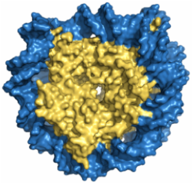

# NucDNADynamics

#### by Ayşe Berçin Barlas, Burcu Özden, Ezgi Karaca

## Background
The nucleosomes have been of great interest due to their importance in chromatin function. They are the main template for diverse vital processes, such as transcription, replication, recombination, DNA repair, and cell division. Although there are several molecular dynamics studies on how histone dynamics regulate the nucleosome function, the relevance of nucleosomal DNA dynamics is yet to be determined.

Here, we explored the role of force fields in reproducing the experimentally observed nucleosomal DNA (nucDNA) geometries and compared two state-of-the-art protein-DNA force fields (FFs), i.e., AMBER parmbsc1 and CHARMM36. 601 nucleosome, which has stable structure, was used for this study. Then, DNA geometry analysis (such as RMSD, RMSF, Groove Widths and Base Pair Parameters) were performed to understand the effect of different force fields on the nucleosome geometries.

We run molecular dynamics simulations of the 601 NCP (PDB ID: 3lz0) under the effect of two different force fields, i.e., AMBER parmbsc1 and CHARMM36 with GROMACS version 5.1.4 (water model: TIP3P, ion conc: 0.15 M Na+ and Cl-, T=310K)
The results presented here come from 2 µs long simulations. To dissect the calculated DNA geometries, we used the [3DNA suite](https://x3dna.org/). 
The analyzed base pair step parameters and groove widths are provided under **base_pair_step_parameter_results** and **groove_width_results** folders, respectively.

## How to parse and analyze 3DNA out files

Here, we provide example Python scripts, **calc_3dna_stats.ipynb**, located under **application_example/** folder that can be used to (i) extract base pair step parameter results from 3DNA output files, (ii) extract minor and major groove widths from 3DNA output files, (iii) combine desired parameter results in a single file, (iv) find maximum, minimum and mean values of selected parameter. **plot_calc_stats.ipynb** located in the same file can be used for visualize the results. 

Under *application_example/* the example 3DNA out files for the simulated nucleosomes are given in *3dna_out/* where the Xtal structures are provided under *xtal/*.

To be able to use our example Python script, in the script **YOUR_DIR/** expression should be replaced with the location of your *NucDNADynamics/* folder.

For more, please check the Python script.

For questions: ezgi.karaca@ibg.edu.tr
